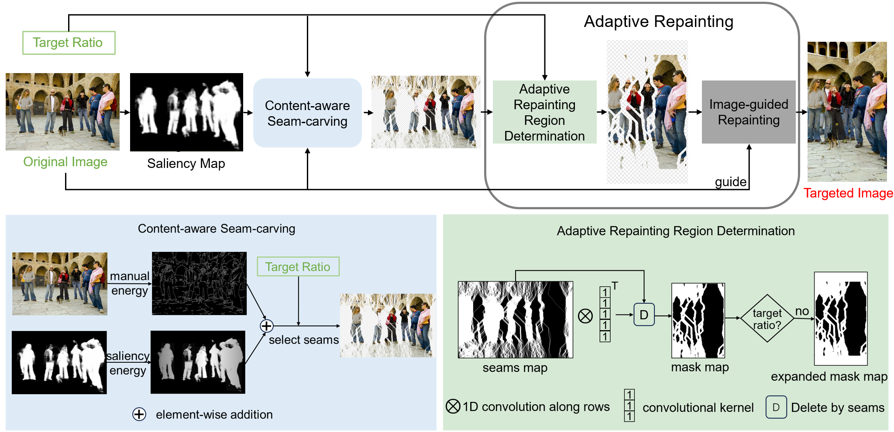

<div align="center">
<h1>PruneRepaint (NeurIPS2024)</h1>
<h3>Prune and Repaint: Content-Aware Image Retargeting for any Ratio</h3>

<!--Paper: ([arXiv:2405.14174](https://arxiv.org/abs/2405.14174))-->
</div>

## Introduction
PruneRepaint is an image retargeting method that introduces high-level semantic information and  low-level structural prior to the retargeting process. This repository contains the code of PruneRepaint for retargeting an image to any aspect ratio. For more information, please refer to our paper.

<p align="center">
  
</p>


## Quick Start


To retarget images, use the following commands:

```bash
python PruneRepaint.py  --target_ratio "4/3" --save_image_path "/path/to/save/" --input_image_path "/path/to/original/images/"
```


## Citation
If PruneRepaint is helpful for your research, please cite the following paper:
```
@article{shen2024prunerepaint,
      title={Prune and Repaint: Content-Aware Image Retargeting for any Ratio}, 
      author={Feihong Shen, Chao Li, Yifeng Geng, Yongjian Deng and Hao Chen},
      year={2024}
}
```


## Acknowledgment

This project is based on Stable Diffusion([paper](https://openaccess.thecvf.com/content/CVPR2022/papers/Rombach_High-Resolution_Image_Synthesis_With_Latent_Diffusion_Models_CVPR_2022_paper.pdf), [code](https://github.com/CompVis/latent-diffusion)), IP-Adapter ([paper](https://arxiv.org/abs/2308.06721), [code](https://github.com/tencent-ailab/IP-Adapter)), ControlNet ([paper](https://arxiv.org/abs/2302.05543), [code](https://github.com/lllyasviel/ControlNet)), VST ([paper](https://arxiv.org/abs/2104.12099), [code](https://github.com/nnizhang/VST)) and SeamCarving ([paper](https://dl.acm.org/doi/10.1145/1276377.1276390)),
 thanks for their excellent works.

